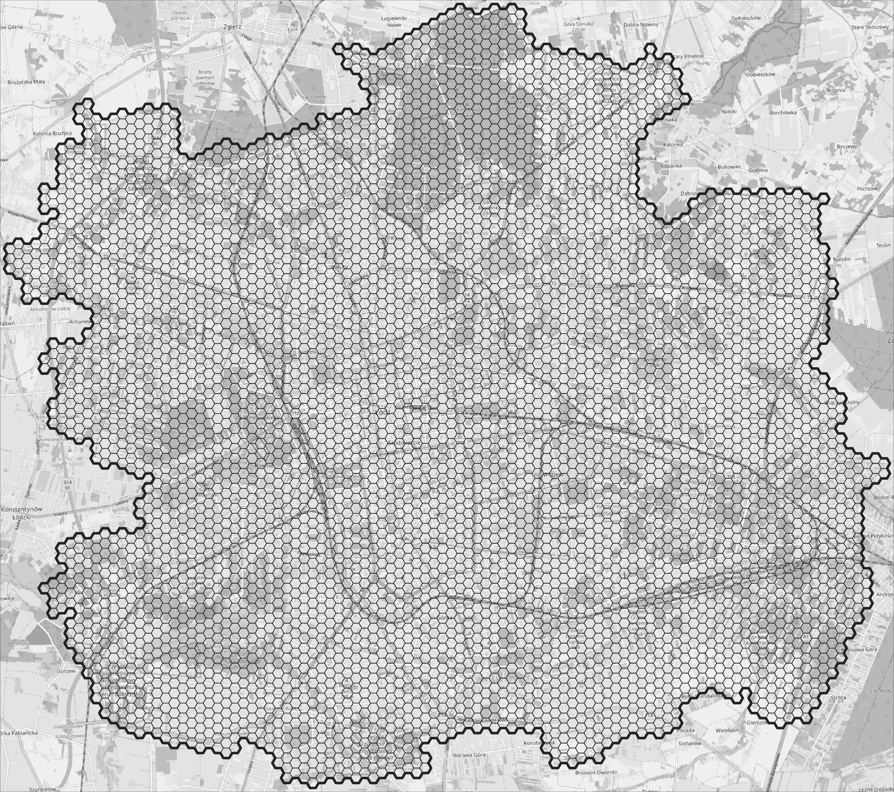
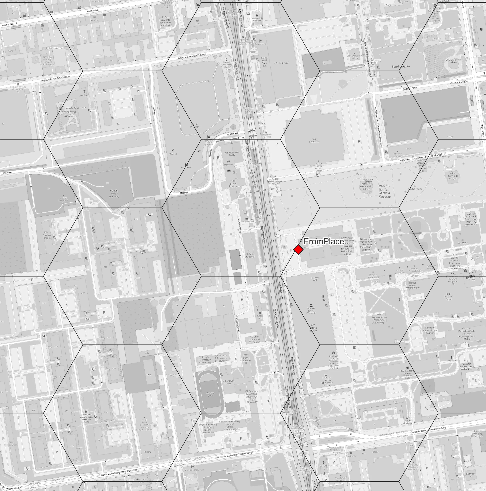
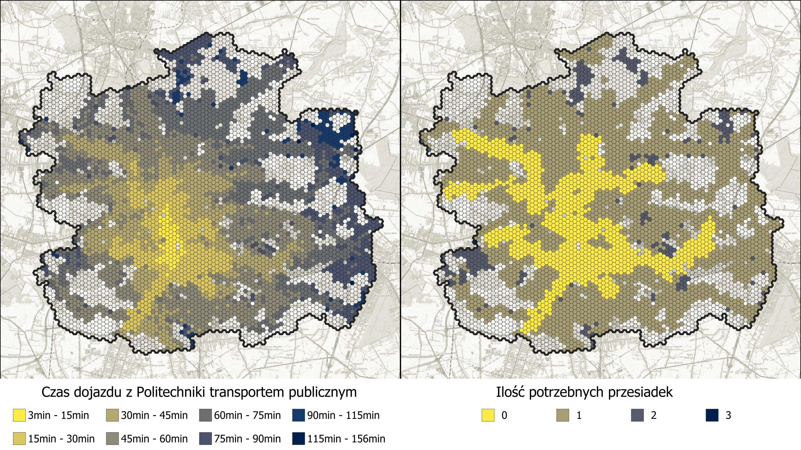

<!--Testowy [link](test/test.md)-->
# GISday 2024

STRONA W BUDOWIE

## **Wstęp**
To repozytorium zawiera prezentacje wygłoszoną na wydarzeniu GISday 2024 na Uniwersytecie Łódzkim na wydziale Ekonomiczno - socjologicznym.
Prezentacja została podzielona na 3 części i zawiera informacje odnośnie użytkowania 3 narzędzi do analiz komunikacyjnych w środowisku GIS.

1. [Narzędzia wbudowane w QGIS + wtyczki](#narzedzia-wbudowane-w-qgis-wtyczki)
2. [OpenTripPlanner + R](#opentripplanner-r)
3. [Narzędzia symulacyjne VISSIM + TomTomMOVE](#narzedzia-symulacyjne-vissim-tomtom-move)

## Narzędzia wbudowane w QGIS + wtyczki
W pierwszej części prezentacji zostały omówione bazowe funkcje QGIS, takie jak korzystanie z [bufora](https://youtu.be/n2w32iDwDpw?si=88iRhpI_ni4KyV-j&t=508)
lub polecenia [service area](https://youtu.be/xSHN6FKHApk?si=gvFSLw6LsU4ENThG&t=315) w celu wyznaczenia realnej drogi do przystanku.

Następnie przedstawiona została funkcjonalność wtyczek [OpenRouteService](https://openrouteservice.org/), [Valhalla](https://github.com/valhalla/valhalla) oraz [TravelTime](https://traveltime.com/) 
w zakresie [routingu](https://mapsplatform.google.com/maps-products/routes/), tworzenia analiz sieciowych i izochron. Wszystkie wtyczki oferują wybór różnych rodzajów transportu przy wyznaczaniu izochrony, jednak tylko <ins>TravelTime</ins> daje możliwość wyboru generowania izochron od transportu publicznego. 
Niestety wadą tej wtyczki jest [bardzo mała ilość tokenów](https://docs.traveltime.com/qgis/about/reference-manual), którą możemy wykorzystywać do zapytań serwera. *Each API key has a quota of queries that can be done. Currently, for free keys, this is around 10 searches / minute. Once this quota is reached, all subsequent queries fail for the cooldown period*

Podsumowując, narzędzia wbudowane oraz wtyczki są to narzędzia szybko działające oraz bardzo proste w obsłudze. Ogarniczenia jakie dotyczą tych narzędzi to mała liczba zapytań do API i zależność od danych z zewnętrznego serwera oraz ograniczone możliwości zaawansowanych analiz multimodalnych.
Biorąc pod uwagę zalety oraz wady tych narzędzi znajdują one zastosowanie w prostych analizach oraz przy małym obszarze opracowania.

## OpenTripPlanner + R
W budowie
### Pobieranie danych
Przed przystąpieniem do analiz zostanie omówione w jaki sposób pozyskać dane potrzebne do przeprowadzenia obliczeń.

Potrzebne będą nam dwie podstawowe rzeczy:

1. Dane o rozkładach jazdy przewoźników w formacie [GTFS](https://github.com/google/transit)
2. Mapa drogowa w formacie [osm.pbf](https://download.geofabrik.de/)

Dane o przewoźnikach możemy pozyskać z dwóch różnych źródeł:

1. [Transitland](https://www.transit.land/)
2. [Mobility Database](https://mobilitydatabase.org/)
Ja swoje dane dla łodzi pobrałem z [tej strony](https://www.transit.land/feeds/f-u3jy-lodz)

Kiedy mamy dane dotyczące rozkładów jazdy następnym krokiem będzie pobranie informacji o sieci drogowej OSM z serwera [Geofabrik](https://download.geofabrik.de/). W tej analizie użyłem danych dla [województwa łódzkiego](https://download.geofabrik.de/europe/poland/lodzkie.html)

### Konfiguracja serwera OTP
Po pobraniu danych przejdziemy do konfiguracji serwera oraz środowiska.
Pierwszy krok to pobranie pliku aplikacji OTP w formacie .jar w wersji [1.5.0](https://github.com/opentripplanner/OpenTripPlanner/releases/tag/v1.5.0).
Do uruchomienia tej aplikacji potrzebne będzie nam środowisko [JAVA w wersji 8](https://www.oracle.com/java/technologies/downloads/#java8-windows)
Następnie potrzebujemy zainstalować język [R](https://cran.rstudio.com/bin/windows/) oraz interfejs [RStudio](https://posit.co/download/rstudio-desktop/)

Kiedy mamy pobrane i zainstalowane wszystkie komponenty przejdzmy do konfiguracji folderu w którym będziemy pracować. Powinniśmy stworzyć folder, do którego będziemy mieli szybki dostęp, bez polskich znaków i spacji w nazwie, ponieważ może to spowodować błąd w ścieżce dostępu. Ja swój folder stworzyłem w lokalizacji: `C:\Users\Michal\otp_data`. To będzie nasz folder główny z plikiem `.jar`, w tym folderze głównym tworzymy nowy folder `graphs`, folder nazwany taką nazwą jest rozpoznawany jako tzw. `router`, będzie nam to potrzebne w dalszej części analizy. W folderze `graphs` tworzymy nowy folder w którym będziemy przechowywać plik `gtfs.zip` i `.osm.pbf`. (**Plik z rozkładami jazdy musi zawierać w nazwie GTFS oraz musi mieć rozszerzenie .zip. Plik z mapą osm również musi być w formacie .osm.pbf**) Folder możemy go nazwać od nazwy analizowanej miejscowości np. `Lodz`, w takim wypadku nazwa `Lodz` stanie się nazwą `routera` i będzię można go w ten sposób wywołać. Struktura folderu powinna wyglądać w taki sposób:
```
/otp_data
    otp.jar
    /graphs
        /lodz
        lodz_gtfs.zip
        lodz.osm.pbf
```
Po skonfigurowaniu struktury folderu przejdziemy do uruchomienia aplikacji z command line, potrzebne będą nam do tego 3 podstawowe komendy
```
java -Xmx4G -jar otp.jar --build C:\Users\Michal\otp_data\graphs\lodz
```
Ta komenda buduje `graph` i zapisuje do pliku `.obj`, przechowywane są tam dane na temat sieci drogowej oraz nałożone trasy środków transportu publicznego. Plik zostanie odrazu dodany do folderu `lodz`

Następnie wpisujemy komende do uruchomienia serwera.
```
java -Xmx4G -jar otp.jar --router lodz --graphs graphs --server
```
Jako router wskazujemy folder `lodz`, parametr `--graphs` wskazuje w jakim folderze aplikacja ma szukać zapisanego graphu. parametr `--server` uruchamia serwer, do którego będzie mogli wysłać zapytanie.

Trzecia komenda potrzebna będzie nam w dalszej części analizy
```
java -Xmx4G -jar otp.jar --router lodz --graphs graphs --server
--analyst
--pointSets C:\Users\Michal\otp_data\
```
parametr `--analyst` rozszerza możliwości aplikacji o dodatkowe analizy, a `--pointSets` pozwala nam dodać punkty w formacie tabeli z roszerzeniem `.csv`, których będziemy mogli później użyć.

Jeżeli udało nam się wszystko zrobić zgodnie z instrukcją na końcu wiersza poleceń powinniśmy dostać komunikat 
`Grizzly server running`

Będziemy mogli się do niego podłączyć poprzez wpisanie w przeglądarkę [localhost:8080](localhost:8080)

Z serwera OTP możemy korzystać z funkcji przeglądania jak i wpisywania zapytań bezpośrednio z poziomu przeglądarki internetowej, jednak jest to sposób wysoce nieefektywny i narażony na możliwość łatwego popełniania błędów w składni zapytania, dlatego do generowania zapytań będziemy używać języka R i RStudio.

### Skrypty w języku R

<!--Z względu na możliwość dużej automatyzacji oraz prosty syntax języka R bardzo dobrze nadaje się on do analizy danych.-->

#### Izochorny
Po uruchomieniu RStudio będziemy musieli zainstalować bibliotekę `otpr` by móc jej używać
```R
install.packages('otpr') # Instalacja biblioteka otpr
```
Kod poniżej zwróci nam izochorny dojazdu komunikacją miejską w odstępach czasowych 15, 30 i 45minut i zapisze do pliku geojson
```R
library("otpr") # Załadowanie biblioteki otpr

setwd("C:/Users/Michal/otp_data") # Ustawienie folderu roboczego
otpcon <- otp_connect() # Połączenie się z API
my_isochrone <- otp_get_isochrone(otpcon,
                location = c(51.7474, 19.4518), # Wskazanie punktu początkowego w stopniach
                fromLocation = FALSE, # Analiza DO punktu początkowego
                cutoffs = c(900, 1800, 2700), # Ustawienie wielkości izochron 15, 30, 45 min
                mode = "TRANSIT", # Ustawienie środka transportu
                date = "11-22-2024",
                time = "08:30:00",
                maxWalkDistance = 700) # Maksymalna odlegość piesza z i na przystanek
write(my_isochrone$response, file = "my_isochrone.geojson") # Zapisanie odpowiedzi serwera do pliku 
```
Mapa wynikowa wygląda w następujący sposób

[Pobierz geojson](assets/OpenTripPlanner/isochrone.geojson)

Plik `.geojson` możemy wrzucić również do QGIS'a metodą drag&drop i tam poddać go dalszej analizie
#### Czas dojazdu z wielu miejsc

Będziemy przeprowadzać analizę dojazdu z wielu punktów do jedengo określonego miejsca,
dzięki automatyzacją w języku R wykonamy to zadanie przy użyciu pętli `for`

Diagram ideowy pomysłu prezentuje się następująco:

W pierwszym kroku tworzymy siatkę heksagonalną o oczku 250m.
<!---->
<!---->
<div class="steps">
  <figure>
    
    <figcaption>Krok 1</figcaption>
  </figure>
</div>

Następnie wybieramy nasz punkt startowy, ja wybrałem miejsce przed wydziałem budownictwa na Politechnice Łódzkiej.
<!---->
<!---->
<div class="steps">
  <figure>
    
    <figcaption>Krok 2</figcaption>
  </figure>
</div>

Następnie generujemy dla każdego heksagonu centroidy.
<!---->
<!---->
<div class="steps">
  <figure>
    
    <figcaption>Krok 3</figcaption>
  </figure>
</div>

Centroidom nadajemy współrzędne geograficzne w postaci długości i szerokości geograficznej. **Pola muszą nazywać się lat(latitude) i lon(longitude)**
```SQL title="Krok 4"
x(transform($geometry, 'EPSG:2177', 'EPSG:4326'))
y(transform($geometry, 'EPSG:2177', 'EPSG:4326'))
```

Ostatecznie nasz skrypt będzie działał tak jak zostało to pokazane na obrazku poniżej
<!---->
<!---->
<div class="steps">
  <figure>
    
    <figcaption>Krok 5</figcaption>
  </figure>
</div>

W QGISie eksportujemy centroidy do pliku `.csv`. Punkty oprócz współrzędnych muszą zawierać jedno pole numeryczne (może być to np. ilość osób w heksagonie lub liczba miejsc pracy) Ja swój plik nazwałem `pop.csv` ze względu na to, że ma zapisaną liczbę osób mieszkających w każdym heksagonie.


```R title="Czas dojazdu z wielu miejsc"
library("otpr")

setwd("C:/Users/Michal/otp_data") # Set working directory
pop <- read.csv("pop.csv")
head(pop)
total <- nrow(pop) # Utworzenie tabeli total
otpcon <- otp_connect()
# Begin the loop
for (i in 1:total) { #Zapytanie każdego wiersza w tabeli total
  response <- otp_get_times(otpcon, 
                            fromPlace = c(pop[i, ]$lat, pop[i, ]$lon), 
                            toPlace = c(51.7474, 19.4518), 
                            mode = "TRANSIT", 
                            detail = TRUE, 
                            date = "11-22-2024",
                            time = "08:30:00", 
                            maxWalkDistance = 700, 
                            walkReluctance = 5,
                            minTransferTime = 600)
  
  # If response is OK update dataframe
  # Dodanie do tabeli atrybutów informacji o parametrach przejazdu
  if (response$errorId == "OK") {
    pop[i, "status"] <- response$errorId
    pop[i, "duration"] <- response$itineraries$duration
    pop[i, "transittime"] <-response$itineraries$transitTime
    pop[i, "walktime"] <-response$itineraries$walkTime
    pop[i, "waitingtime"] <- response$itineraries$waitingTime
    pop[i, "transfers"] <- response$itineraries$transfers
  } else {
    # record error
    pop[i, "status"] <- response$errorId
  }
}
write.csv(pop, file = "pop_results2.csv") # Zapisanie do pliku
```

Mapa czasów dojazdów i ilości potrzebnych przesiadek prezentuje się w następujący sposób:

#### One-to-many analysis

OTP posiada moduł pozwalający policzyć czas dojazdu do wielu różnych punktów. Do obliczenia tego uzyjemy polecenia surface. Mogłoby się wydawać, że będzie to powtórzenie poprzedniej analiy, jednak poprzez użycie surface znacznie skraca nam się czas analiy, ponieważ narzędzie OTP jest w stanie wygenerować surface model mniej więcej w takim samym czasie co pojedyncze zapytanie o trasę. Osiągane jest to przez zapisanie czasu dojazdu do każdego miejsca z punktu startowego w komórkach rastra.

W celu przeprowadzenia


## Narzędzia symulacyjne VISSIM + TomTom MOVE
W budowie

## Źródła
W budowie
Ta prezentacja napewno by nie powstała gdyby nie niesamowita praca wykonana przez użytkownika [marcusyoung](https://github.com/marcusyoung) i jego [bibliotekę do języka R](https://github.com/marcusyoung/otpr) 
oraz [poradnik jak korzystać z OTP](https://github.com/marcusyoung/otp-tutorial)